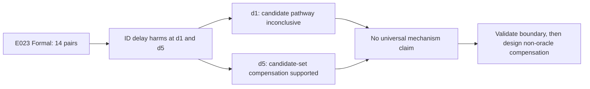

# E023 Formal Analysis Report

## Executive Decision

Formal run:

```text
outputs/20260813_mdmt_mia_id_supplement_cascade_formal_v8/
```

The run is scientifically valid: all 40 measurement gates passed, `Y00`
exactly reproduced the frozen synchronous reference, and the run manifest
freezes source variant `packetized_id_supplement_cascade_v8`, commit
`7fcea6808bff2e17e435b39e3f44c00d73d92488`, 14 official pairs, seed 7 and
10000 paired bootstrap samples.

The formal decision is:

```text
heterogeneous_or_unresolved_mechanism
```

This does **not** mean that the experiment found no mechanism. It means the
pre-registered mechanism pattern differs by delay:

- `d1`: ID delay is harmful, but the candidate-set edge and extra Supplement
  compensation are inconclusive.
- `d5`: ID delay is harmful, while the delay-created candidate set provides a
  statistically supported **compensatory** Supplement pathway.

The defensible conclusion is therefore delay-conditioned: direct ID-state harm
and candidate-set-mediated compensation coexist at five frames, but that
compensatory pathway is not identifiable at one frame.

## Conditions

| Condition | ID state | Supplement | High-score candidate membership |
| --- | --- | --- | --- |
| `Y00` | timely | timely | synchronous |
| `Y10` | delayed | timely | actual delayed-state set |
| `Y01` | timely | expired | synchronous |
| `Y11` | delayed | expired | actual delayed-state set |
| `Yec` | delayed | timely | oracle synchronous set; diagnostic only |

`Yec` changes only High-score candidate membership. It is an oracle causal
diagnostic, not a deployable method.

## 1. Hypothesis Check

### Q1: Does ID-state delay harm tracking?

Supported at both delays.

| Delay | MDA loss `Y00-Y10` | 95% CI | Pair directions | IDF1 loss | IDSW increase |
| ---: | ---: | ---: | ---: | ---: | ---: |
| 1 | 0.013350 | [0.003154, 0.023453] | 13 positive / 1 negative | 0.003293 | 71.39 |
| 5 | 0.025750 | [0.012466, 0.039962] | 13 positive / 1 negative | 0.007954 | 80.11 |

The MDA effect grows descriptively from 1.34 to 2.57 points. Pair 57 is the
only pair with the opposite MDA direction at both delays; it does not overturn
the registered 13/14 direction test.

### Q2: Is timely Supplement more valuable under delayed ID state?

At `d1`, the extra compensation contrast is inconclusive:

```text
C_comp = 0.021017
95% CI = [-0.004635, 0.052553]
directions = 8 positive / 6 negative
```

At `d5`, it is supported:

```text
C_comp = 0.049913
95% CI = [0.014343, 0.096598]
directions = 10 positive / 4 negative
```

Thus timely Supplement has measurably greater marginal value when ID state is
five frames late, but not when it is one frame late.

### Q3: Is the candidate-set pathway destructive or compensatory?

At `d1`, `R_edge = Yec-Y10` is indistinguishable from zero:

```text
R_edge = +0.000355
95% CI = [-0.002629, 0.003467]
directions = 5 positive / 7 negative / 2 zero
```

At `d5`, cutting the delayed candidate-set edge reduces MDA:

```text
R_edge = -0.018329
95% CI = [-0.036894, -0.004305]
directions = 4 positive / 10 negative
```

The negative sign is important. `Yec` removes candidate opportunities created
by delayed ID commit. Its worse MDA means those opportunities are beneficial
on net at five frames. This does not mean ID delay is beneficial overall:
`Y10_d5` still loses 0.025750 MDA relative to `Y00`; the candidate pathway only
partially compensates for the direct delay harm.

Overall hypothesis verdict: **partially supported and delay-conditioned**.
Pattern B is supported at `d5`; no predefined mechanism is supported at `d1`.

## 2. Baseline Comparison

Macro metrics over 14 pairs:

| Condition | MDA | MOTA | IDF1 | IDSW |
| --- | ---: | ---: | ---: | ---: |
| `Y00` | 0.383154 | 0.513848 | 0.666922 | 178.04 |
| `Y10_d1` | 0.369804 | 0.509070 | 0.663629 | 249.43 |
| `Yec_d1` | 0.370159 | 0.508887 | 0.663728 | 252.11 |
| `Y01_d1` | 0.366434 | 0.514662 | 0.668235 | 172.29 |
| `Y11_d1` | 0.332067 | 0.509772 | 0.664408 | 243.14 |
| `Y10_d5` | 0.357404 | 0.508712 | 0.658968 | 258.14 |
| `Yec_d5` | 0.339075 | 0.508680 | 0.659081 | 262.96 |
| `Y01_d5` | 0.366434 | 0.514662 | 0.668235 | 172.29 |
| `Y11_d5` | 0.290771 | 0.508006 | 0.657032 | 273.29 |

`Y00` is the MDA upper reference and `Y11` is the worst condition. The
important reversal is `Yec_d5 < Y10_d5`: restoring synchronous candidate
membership while keeping ID delay does not recover performance; it removes a
useful compensation route.

MDA and IDF1/MOTA do not have identical rankings. For example, `Y01` has lower
MDA than `Y00` but slightly higher IDF1 and lower IDSW. This is not enough to
invalidate the result: MDA is the registered cross-device endpoint, while the
secondary metrics capture different parts of tracking quality.

## 3. Failure Modes

The failure is state-specific rather than a detector-wide collapse:

1. ID-state delay causes stable MDA loss and large IDSW increases at both
   delays.
2. Supplement uses a frame deadline. Therefore `Y01_d1` and `Y01_d5` are
   identical: any nonzero delay expires the frame-level Supplement packet.
3. At five frames, delayed ID commit creates many more candidate disagreements
   and High-score opportunities. Timely Supplement can use them to mitigate
   loss.
4. The effect size is heterogeneous across pairs. Pair 48 contributes a large
   `d5 R_edge` effect (-0.112497), but the conclusion is not solely driven by
   it: the median is -0.004752 and 10/14 pairs have the registered negative
   direction.

The observed transition is not a simple monotonic "more delay, more harm"
story. Longer delay increases direct harm, but it also activates a recovery
path through the unmatched candidate set.

## 4. Upper-Bound Analysis

Relative to synchronous `Y00`:

- `Y11_d1` loses 0.051087 MDA.
- `Y11_d5` loses 0.092382 MDA.
- Keeping Supplement timely (`Y10` instead of `Y11`) recovers 0.037737 at d1
  and 0.066633 at d5, about 74% and 72% of the respective total MDA deficits.

The remaining gap is the direct ID-delay component. The present experiment does
not test a deployable method for closing it. `Yec` cannot be treated as an
upper bound because it uses an oracle shadow membership intervention and, at
five frames, removes useful asynchronous opportunities.

## 5. Generalizable Signals

1. **Delay changes algorithmic control flow, not only information freshness.**
   A stale ID state changes which targets reach Supplement.
2. **An asynchronous side path can compensate for stale upstream state.**
   Removing delay-induced candidates can be worse than retaining them.
3. **Atomic ID+Supplement commit is not justified by the parent interaction
   result.** The channels are alternative branches with feedback, not two
   naturally co-produced fields of one candidate transaction.
4. **Cross-device and per-view metrics must remain separate.** MDA exposes the
   mechanism more clearly than MOTA/IDF1 in this experiment.

These principles may transfer to other closed-loop multi-camera trackers, but
the numerical effects are specific to MDMT, MIA-Net, fixed delays and offline
first-frame initialization.

## 6. Historical Comparison

The parent E022 experiment identified a non-additive `ID state + Supplement`
loss at five frames. E023 refines that finding:

- It confirms a real closed-loop interaction at five frames.
- It rejects the stronger interpretation that the interaction is direct
  evidence for a destructive joint transaction.
- It shows that the candidate-set edge is compensatory at five frames and
  unresolved at one frame.

The two-pair MVE had already suggested Pattern B at d5. The 14-pair Formal
confirms it under the registered CI and direction rules. The Formal result also
preserves the MVE warning that d1 does not support the same mechanism.

## 7. Next Actions

1. **P0: close E023 as `MODIFY`, not `CONTINUE` on joint transactions.** Keep
   the R4 cascade pivot and narrow the claim to a delay-conditioned
   compensatory pathway.
2. **P0: validate the mechanism onset outside the official test set.** Use MDMT
   validation data or another held-out dataset to test intermediate delays and
   pre-register the boundary analysis. Do not tune a d2/d3 rule on these 14
   test pairs.
3. **P1: design a deployable version-aware compensation mechanism.** It may
   retain safe unmatched-candidate recovery opportunities under stale ID state,
   but it must not read oracle `S_cf`, rewrite history, or insert old bboxes.
4. **P1: explain pair heterogeneity.** Pre-register moderators such as
   disagreement rate, successful High-score write-in rate, target density and
   homography quality, then test them on non-test data.
5. **P2: validate without offline first-frame GT initialization and under
   asymmetric delay/jitter.** This tests whether the mechanism survives a more
   realistic online setting.

## Flowchart

Source:
`mermaid/exp_20260808_001_mdmt_mia_id_supplement_cascade/formal_result_flow.mmd`



## Limitations

- Only two fixed delays were confirmatory.
- Pair-level bootstrap has `n=14`; frame/candidate logs are diagnostics, not
  independent samples.
- `Yec` is oracle-only.
- Supplement uses a nonzero-delay expiry policy, so its delay curve is a
  deadline cliff rather than a graded staleness curve.
- The run uses the official test set and offline first-frame initialization;
  it must not be reused for parameter tuning.
