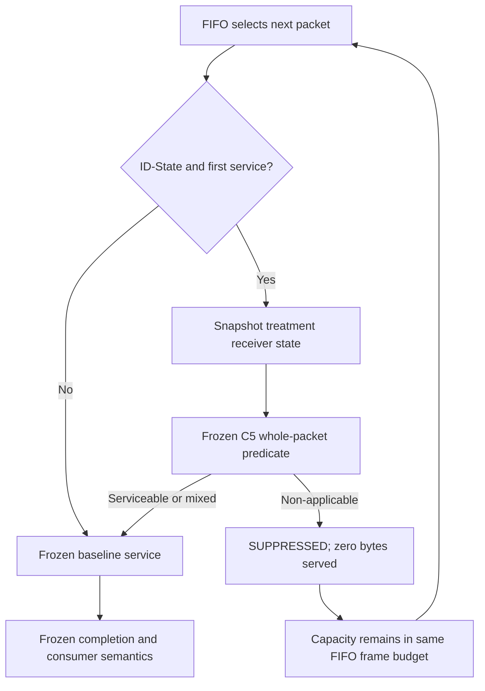

# EXPERIMENT_CONTRACT

## C6 TRUE-First-Service ID-State Semantic Suppression

**Status:** `PROPOSED / DRAFT — NOT AUTHORIZED FOR IMPLEMENTATION OR SCIENTIFIC EXECUTION`

**Experiment ID:** `exp_20260915_001_mdmt_mia_c6_pre_service_semantic_suppression`

**Contract date:** 2026-09-15

**Upstream evidence:** C4 finite-service baseline and C5 Run004 Shadow Opportunity Census

**Possible downstream stage:** C7 tracking-consequence evaluation, only after a separate Research Decision and authorization

This contract is an experiment-design artifact. It authorizes no source change,
qualification run, scientific execution, baseline re-execution, tracking
evaluation, C7, C8, scheduler, or policy-learning work.

---

## 1. Identity and governance binding

### 1.1 Observed repository authority at drafting time

| Field | Value | Epistemic status |
| --- | --- | --- |
| Authoritative worktree | `/mnt/data/yzm/experiments/matrix_async_pose_comm_tracking/.worktrees/c5_shadow_validator_path_corrective` | `FACT` |
| Branch | `fix/20260914-c5-shadow-validator-path` | `FACT` |
| HEAD | `09747e7de973b8a08f0cd08c97e3649fc2b8496b` | `FACT` |
| C5 execution-enabled candidate | `9a511c3ce300b5dedb1f2e970f131ddd2522b0c0` | `FACT` |
| C5 candidate parent | `0722eefa98b350ec3c0a0672db89dd40caca966a` | `FACT` |
| C5 Q5 qualification evidence | `f4fafe81f86cf00b0ac28b340ad0aa929507e295` | `FACT` |
| C5 Run004 authorization commit | `09747e7de973b8a08f0cd08c97e3649fc2b8496b` | `FACT` |
| C5 Run004 authorization raw SHA-256 | `5406ae61a69b049f51b8ba6a48687e3c68041459ca22f1474891a0530672f10a` | `FACT` |
| Frozen C5 contract authority | `1a664abdba12bc3e720ac3e728003e5ecd4ffa04` | `FACT` |
| Frozen C5 contract raw SHA-256 in this worktree | `7595cf1973ded33e1f9046be00556f8a9b87c6613853bff45ec81f79927d4e25` | `FACT` |
| Production implementation authority | `846350036f4169b0715e4d33caaa54c947a5e8e7` | `FACT` |
| C5 predicate/runtime source SHA-256 | `b870c9fe4364d01cd1f8c7ce59240d6fa97d2ce65caff809afef3f1f9c6c0a66` | `FACT` |
| Generated author runtime SHA-256 | `b870c9fe4364d01cd1f8c7ce59240d6fa97d2ce65caff809afef3f1f9c6c0a66` | `FACT` |
| Generated author entry SHA-256 | `f7113f3d0ff08891b526c320051a3801bccb2a14891226a900c62e71946d5316` | `FACT` |
| Generated source manifest SHA-256 | `02f2f001d6a9dbb7120f0dd5dce6e98556e707f581a5b16d20f6ec68b770e224` | `FACT` |
| C6 experiment-index row at drafting time | Absent | `FACT` |

The implementation plan must re-read and bind these authorities. A mismatch is
a governance blocker; it must not be repaired by silently selecting another
commit, worktree, runtime, or artifact.

### 1.2 C5 Run004 immutable evidence identity

```text
RUN_ID = c5_shadow_census_20260914_004
RUN_STATUS = COMPLETE
SCIENTIFIC_CELLS = 4 / 4
RUN_END_RAW_SHA256 = d0941f0c487c0e63324f999d9cdb2101f7013fa15b229459b09f272bdd3f9a05
```

Per-cell Shadow seal raw SHA-256:

| Cell | Seal SHA-256 |
| --- | --- |
| P23 / FIFO-mild | `d46e0a910ecb2cbe0cce5cb5131ee6dea010fdd34d8194a2dbab562dca0688b9` |
| P23 / FIFO-strong | `bd53485bcdd93b7b276426900360d7341333bf960ad714f8776831473c098226` |
| P44 / FIFO-moderate | `ec530381f35090812dd60130246c367e2873b72c337a849fd10c3b63e407deab` |
| P66 / FIFO-mild | `063ba60e148d04b90bf9fbc60353e685d0caf2d38fc45ec10e28b633e9d435a9` |

The ignored Run004 output tree is baseline evidence and must remain byte
immutable. C6 must use a new output root and must never write into Run004.

### 1.3 Contract authority lifecycle

Contract path:

```text
summary_md/experiments/2026-9-15/
  exp_20260915_001_mdmt_mia_c6_pre_service_semantic_suppression/
  EXPERIMENT_CONTRACT.md
```

This draft is not authoritative merely because it exists. After governance
approval, a dedicated contract commit and the raw SHA-256 of the approved file
must be recorded by the implementation plan. A self-referential file hash is
not embedded in this draft.

---

## 2. Question and evidence

### 2.1 One research question

> Under the same frozen finite logical service model, does suppressing an
> ID-State packet that is whole-packet currently non-applicable at its
> treatment-path TRUE-first-service boundary eliminate that packet's logical
> service obligation, and does the released capacity increase service delivered
> to ID-State packets that are serviceable at their own TRUE-first-service?

### 2.2 Premise classification

#### FACT

- C4 provides a deterministic finite logical shared FIFO service model for
  ID-State and Supplement; Local and Homography retain their frozen bypass
  semantics.
- C5 Run004 completed all four pre-registered cells with valid Shadow seals and
  no integrity failure.
- C5 observed non-zero whole-packet non-applicable wire exposure in all three
  frontier cells.
- C5 performed observation only. It did not suppress, reorder, resize, or
  reserialize packets and did not measure tracking outcomes.
- The frozen C5 predicate is evaluated from packet contents and current
  receiver rows, confirmed state, `_applied_id_map`, and
  `_last_id_packet_version` at TRUE-first-service.
- Empty audited task-effect packets are opportunities under the frozen C5
  contract; mixed-effect packets remain serviceable as whole packets.

#### INFERENCE

- C5's positive frontier exposure makes a treatment-path suppression experiment
  informative.
- Eliminating non-applicable packet work may release service capacity for other
  queued work.
- Released capacity may be absorbed by serviceable ID-State, Supplement, or
  idle service; C5 does not establish which outcome will occur.

#### ASSUMPTION

- The C5 predicate can be invoked on the treatment trajectory at the same
  causally legal TRUE-first-service boundary without reading future or outcome
  information.
- The treatment can assign `SUPPRESSED`, consume zero bytes, and immediately
  continue the same FIFO service loop without adding priority or a one-slot
  delay.
- A baseline value for serviceable ID-State serviced bytes can be derived
  reproducibly from immutable C5 Run004 Shadow records and service ledgers.
- C6 can preserve the frozen external inputs, packet-generation code and
  rules, service budgets, serialization, observation horizon, and non-target
  channel behavior. The realized treatment packet population may nevertheless
  diverge as a direct causal consequence of changed receiver state.

#### UNKNOWN

- Whether suppression remains non-zero after applicability is re-evaluated on
  the diverging treatment trajectory.
- Whether released service increases serviceable ID-State serviced bytes.
- Whether released service is instead consumed by Supplement or becomes idle.
- Whether any communication-side effect later improves, harms, or leaves
  tracking unchanged; tracking is outside C6.
- Exact wall-clock runtime before an implementation preflight measures it.
- Whether a complete and reproducible Run004 baseline derivation can be sealed
  without adding new general-purpose tracing. Failure requires
  `NEEDS_RESEARCH_DECISION`.

### 2.3 Mechanism hypothesis (`H_M`)

In the primary efficacy cell P23 / FIFO-strong:

```text
B_avoided > 0
```

`H_M` asks whether treatment-path pre-service suppression eliminates a
non-zero logical service obligation.

### 2.4 Redistribution hypothesis (`H_R`)

In the primary efficacy cell P23 / FIFO-strong:

```text
delta_serviceable_id_state_serviced_bytes > 0
```

`H_R` asks whether released capacity increases service delivered to currently
serviceable ID-State work.

```text
H_M true AND H_R true
```

supports requesting a new C7 Research Decision; it is not the sole definition
of a positive C6 mechanism result. The pre-registered boundary result remains:

```text
B_avoided > 0
AND
delta_serviceable_id_state_serviced_bytes <= 0
```

This is `mechanism supported; redistribution not supported`. The hypotheses are
separated by the pre-registered service-accounting metrics below.

---

## 3. Experimental design

### 3.1 Primary causal variable

```text
TRUE-first-service ID-State whole-packet semantic gate:
  BASELINE = disabled (immutable C5 Run004 reference)
  TREATMENT = enabled with treatment-path online re-evaluation
```

No other scientific variable may change.

### 3.1.1 Causal trajectory rule

```text
Treatment internally remains strict FIFO.

Treatment != Baseline - {suppressed baseline packets}
```

Suppression changes receiver state. That change may legally alter future
semantic state and the later treatment packet population. C6 therefore compares
system-level cell totals under identical external inputs and frozen generation
rules, not a mechanically edited baseline trace. The only permitted service
ordering invariant is treatment-internal FIFO: after a suppression, the current
treatment queue immediately selects its own next FIFO item without look-ahead,
priority, or baseline-label replay.

### 3.2 Safety baseline

The formal baseline is the sealed C5 Run004 FIFO trajectory. It is reused and
must not be rerun. A new baseline execution is not authorized by this contract.

Baseline reuse is valid only after a qualification step proves that C6 uses the
same:

- dataset and split;
- pair/sequence population and observation horizon;
- detector, tracker, checkpoint, and thresholds;
- packet schema, serialization, and byte-accounting convention;
- packet-generation and delay rules;
- per-cell service budget and FIFO semantics;
- non-target channel behavior;
- external input fingerprints.

If any item cannot be bound mechanically, formal comparison is blocked and
requires a new Research Decision.

### 3.3 Diagnostic upper bound

For each treatment cell, the algebraic ceiling is:

```text
sum(JSON_WIRE_BYTES of all treatment-path ID-State packets
    reaching TRUE-first-service)
```

This ceiling is a consistency bound, not a runnable oracle arm, performance
target, or claim that all ID-State work should be suppressed. C5 baseline
opportunity bytes are a descriptive reference, not a treatment-path upper bound
because the treatment receiver trajectory may diverge.

### 3.4 Frozen cells and roles

| Role | Pair | Condition | R logical bytes/frame | C5 opportunity reference |
| --- | ---: | --- | ---: | ---: |
| Extreme suppression stress/control | 23 | FIFO-mild | 31,987 | 7,099,295 / 7,099,295 bytes |
| Primary efficacy | 23 | FIFO-strong | 16,649 | 2,968,912 / 6,190,086 bytes |
| Low-opportunity near-no-op control | 44 | FIFO-moderate | 26,148 | 55,990 / 5,592,692 bytes |
| Low-opportunity near-no-op control | 66 | FIFO-mild | 31,987 | 156,485 / 5,699,749 bytes |

Cell selection is pre-registered and must not be changed after treatment output
is observed.

### 3.5 Controlled variables

The following are frozen to the corresponding C5 Run004 cell:

- dataset, train/test role, pair, sequence, and frame horizon;
- source images and all input hashes;
- detector checkpoint and inference configuration;
- local tracker, cross-view association, thresholds, and offline initialization;
- packet-generation code/rules, payload schema, encoding, and wire byte cost;
  realized treatment packet population and later enqueue order may change only
  through the gate's direct causal receiver-state consequences;
- delay semantics and determinism controls;
- service mode, `R`, frame budget, FIFO order, and end-of-horizon handling;
- ID-State delayed-consumer behavior for packets that complete;
- Supplement, Local, and Homography behavior;
- runtime environment and generated-author-source binding;
- output and validation schema except for explicitly new C6 suppression
  evidence.

Values not recoverable from the C5 authority are not free parameters. They are
`UNKNOWN / NOT FROZEN BY THIS DRAFT` and must be resolved by governance rather
than guessed during implementation.

### 3.6 Dataset, frame range, seed, detector, tracker, checkpoint

These are inherited exactly per cell from C5 Run004. The implementation plan
must enumerate their concrete paths, hashes, horizon, and determinism values
from the sealed C4/C5 authority before code modification. No replacement,
retuning, new seed sweep, detector rerun, or split change is permitted.

### 3.7 Message schema and delay semantics

- C6 changes no packet payload or `JSON_WIRE_BYTES` encoding.
- ID-State and Supplement retain C4 shared FIFO admission.
- Local and Homography retain their frozen timely-bypass behavior.
- No proactive queue scan, TTL, deadline, priority, repacketization, or
  effect-level pruning is allowed.
- C5 labels are never replayed as C6 decisions.

---

## 4. Frozen intervention semantics

At the instant an ID-State packet is selected by FIFO for its first service,
after selection and before any positive service-byte decrement:

1. Build the same event-local receiver snapshot required by C5, but from the
   current treatment trajectory.
2. Evaluate the exact frozen C5 whole-packet predicate.
3. If whole-packet currently non-applicable:
   - assign terminal lifecycle state `SUPPRESSED`;
   - record the decision and original wire bytes;
   - consume exactly zero service bytes;
   - create no normal delivery, completion, consumer update, or feedback;
   - return untouched capacity immediately to the same shared FIFO pool;
   - continue with the next FIFO item without semantic priority.
4. Otherwise, start ordinary service and make the decision sticky. The packet
   is never checked again and cannot be aborted mid-service.

Additional frozen decisions:

- The gate applies only to ID-State.
- Mixed-effect packets are serviced whole and unchanged.
- Suppression applies only to the current packet instance and creates no
  persistent blacklist, lineage ban, or future deduplication rule.
- `SUPPRESSED` is distinct from `COMPLETED`, network `DROPPED`, `EXPIRED`,
  `OBSOLETE`, or `FAILED`.
- Released capacity is not reserved for ID-State; the next FIFO item may be
  ID-State or Supplement.

### 4.1 Minimal control-flow contract



---

## 5. Measurement contract

### 5.1 Primary mechanism metric

```text
actual_avoided_nonapplicable_id_state_service_bytes
  = sum(original JSON_WIRE_BYTES for packets terminally SUPPRESSED
        after treatment-path TRUE-first-service classification)
```

Symbolically:

```text
B_avoided = sum_{p in SUPPRESSED} wire_bytes(p)
```

This is the eliminated logical service obligation of suppressed packet
instances. It is not net system bandwidth saving, physical link traffic,
effect-level useful bytes, or a cross-run counterfactual claim that every byte
would have been served within the finite observation horizon. The invariant
`served_bytes(p) = 0` for every suppressed packet must be checked separately.

Changing this metric to mean a matched counterfactual within-horizon byte delta
would change the metric definition and requires `NEEDS_RESEARCH_DECISION`.

### 5.2 Most important secondary metric

```text
serviceable_id_state_serviced_bytes
  = positive service bytes actually delivered to ID-State packets
    classified as serviceable at their own TRUE-first-service

delta_serviceable_id_state_serviced_bytes
  = treatment serviceable_id_state_serviced_bytes
    - sealed C5 baseline serviceable_id_state_serviced_bytes
```

Classification is sticky after first service. All actual serviced bytes for a
serviceable or mixed ID-State packet are counted under that packet-level class.
The wording must not imply that every effect or byte inside a mixed packet is
individually useful.

### 5.3 Baseline derivation rule

Before any C6 scientific run, a read-only derivation must:

1. verify all Run004 evidence hashes in Section 1.2;
2. take C5 TRUE-first-service packet classifications from the existing Shadow
   records;
3. join them to the existing C4 service ledger using existing immutable packet
   identity;
4. sum positive baseline service slices for packets classified serviceable;
5. reconcile packet and byte totals with the existing manifest and service
   summary;
6. emit a machine-checkable baseline-derivation context, result, and seal in a
   new evidence-only location without altering Run004.

This is derivation from existing evidence, not a baseline rerun. A missing join
key, non-unique identity, ledger mismatch, or unreproducible total blocks C6
scientific execution.

### 5.4 Secondary and diagnostic metrics

- `suppressed_id_state_packet_count`
- `suppressed_id_state_wire_bytes`
- `suppressed_packet_positive_service_byte_count` — must equal zero
- `checked_id_state_packet_count`
- `checked_id_state_wire_bytes`
- `serviceable_id_state_serviced_packet_count`
- `serviceable_id_state_serviced_bytes`
- `total_id_state_serviced_bytes`
- `total_supplement_serviced_bytes`
- per-frame and total shared-server idle bytes
- queue length, waiting time, first-service frame, completion frame, and
  end-of-horizon pending bytes by channel
- FIFO order and service-slice conservation diagnostics
- suppression reason composition using the existing C5 semantic categories
- all invariant and integrity failure counts

Diagnostics must not be promoted post hoc to co-primary outcomes. Supplement
bytes must not be called useful semantic service because no validated
Supplement applicability predicate exists.

### 5.5 Measurement gates

All gates are mandatory and fail closed:

| Gate | Requirement |
| --- | --- |
| G0 Authority | Exact contract, C5 candidate, Q5 qualification, Run004 authorization, evidence hashes, generated source, inputs, environment, and runtime are bound. |
| G1 Baseline derivation | Run004 serviceable-ID-State baseline is uniquely joined, recomputable, reconciled, and sealed before treatment output is inspected. |
| G2 Predicate identity | C6 uses the exact C5 predicate semantics; an independent fingerprint/behavioral replay passes. |
| G3 TRUE-first-service boundary | Decision occurs once after FIFO selection, while served bytes are zero and remaining bytes equal original wire bytes. |
| G4 Treatment-path state | Snapshot comes from current treatment receiver state; no C5 label, cached baseline decision, end-of-frame reconstruction, or post-service state is used. |
| G5 Zero-service suppression | Every `SUPPRESSED` packet has zero positive service bytes and no delivery/completion/consumer/feedback event. |
| G6 Immediate reuse | Suppression leaves the current frame budget untouched and allows the unchanged FIFO loop to consider the next item immediately. |
| G7 Treatment-internal FIFO | At every treatment service decision, the next item is the head of the current treatment FIFO queue after any just-suppressed head has been removed. No look-ahead, priority, baseline-trace editing, or C5-label replay is introduced. Future treatment packet population may diverge only through the intervention's causal state effects. |
| G8 Sticky pass | Any packet that begins positive service is never re-evaluated or aborted. |
| G9 Non-target parity | Supplement, Local, and Homography semantics and accounting are unchanged except for causal timing consequences of released shared capacity. |
| G10 Causality/leakage | Zero future reads, GT/label reads, outcome reads, published-history rewrites, and source-bypass reads. |
| G11 Accounting | Byte conservation, frame-budget conservation, packet lifecycle exclusivity, denominator integrity, and aggregate recomputation all pass. |
| G12 Isolation/completion | Exclusive run root, exact cell set, one start/end per cell, complete seals, no cross-cell or prior-run artifact reuse. |
| G13 Disabled-gate parity | With C6 treatment disabled in qualification-only synthetic/replay paths, pre-existing packet generation, FIFO service, completion, consumer, feedback, and opaque integrity digests reproduce the frozen reference exactly. Only pre-existing opaque integrity digests needed for non-gate runtime equivalence may be compared. No tracking scientific values or derived tracking outcomes—including MOTA, IDF1, IDSW, per-object identity metrics, or scientific trajectory analysis—may be read, recomputed, interpreted, or surfaced during C6 qualification. If digest comparison requires opening such values, qualification is blocked. |

An invariant or gate failure is `MEASUREMENT_INVALID`, not a negative scientific
result.

### 5.6 Known confounders and checks

| Confounder | Required control |
| --- | --- |
| Treatment trajectory changes future receiver state | Re-evaluate online on treatment state; never replay C5 labels. |
| Released bytes may go to Supplement | Report ID-State, Supplement, and idle-service accounting separately. |
| Packet and byte ratios differ with packet size | Use wire bytes as primary unit and retain packet counts descriptively. |
| Empty audited-effect packets dominate some cells | Preserve the frozen empty rule and report reason composition; do not redefine after results. |
| Mixed packets contain heterogeneous effects | Keep whole-packet service and avoid effect-level utility claims. |
| C5 and C6 packet populations may diverge endogenously | Use system-level cell totals; do not require post hoc matched-work infrastructure. |
| Existing C5 output is ignored by Git | Verify raw hashes and preserve the immutable path before derivation and execution. |
| End-of-horizon unfinished work | Report pending packet/byte accounting and keep the exact C5 horizon/finalization semantics. |
| Low-opportunity cell produces a large treatment result | Trigger a mechanism/instrumentation review; do not automatically call it success. |

### 5.7 Required evidence outputs

Provisional output root:

```text
outputs/20260915_mdmt_mia_c6_pre_service_semantic_suppression/<exact-run-id>/
```

The implementation plan may refine filenames but must preserve the following
minimal immutable information:

- exact-run context and authorization identity;
- Git, contract, runtime, generated-source, environment, input, checkpoint, and
  configuration fingerprints;
- cell identity, role, sequence, horizon, service mode, and `R`;
- one auditable decision record for every ID-State packet reaching
  TRUE-first-service;
- original wire bytes and frozen semantic reason evidence for every suppressed
  packet;
- service-ledger evidence sufficient to prove zero bytes for suppressed packets
  and to recompute serviceable ID-State, Supplement, idle, pending, and total
  service bytes;
- cell-level primary, secondary, and diagnostic result table;
- invariant/gate results;
- run start/end and failure records;
- machine-checkable context, result, and seal files;
- the separately sealed C5 baseline derivation used by every delta.

No new general-purpose lineage or tracing system is required if existing packet
identity and service ledger fields satisfy these gates.

---

## 6. Runs

### 6.1 Pre-execution qualification

Before any scientific treatment run:

1. approve and commit this contract;
2. create a read-only, plan-only implementation plan;
3. derive and independently seal the C5 baseline metric;
4. implement only the C6 gate and minimal evidence fields;
5. run focused synthetic tests for predicate identity, first-service timing,
   zero-byte suppression, immediate reuse, sticky pass, and lifecycle
   exclusivity;
6. replay the existing C4/C5 regression and trajectory-parity suites;
7. run a synthetic four-cell end-to-end path qualification;
8. perform an independent scientific audit;
9. issue a separate exact-run authorization.

None of those steps is authorized by this draft.

### 6.2 Minimum viable experiment

After all qualification and authorization gates pass:

```text
MVE cells = 1 treatment cell
cell = P23 / FIFO-strong
baseline runs = 0; use sealed Run004 reference
```

The MVE is a real-path execution canary: it catches late end-to-end validity
failures on the primary cell before Formal. It cannot authorize C7 or substitute
for the formal four-cell result. Its output uses a unique run ID, may be
recorded and sealed as scientific output, and is never pooled with the Formal
run.

```text
REAL_PATH_MVE = YES
SCIENCE_ADAPTATION_ALLOWED = NO
```

MVE stopping rule:

- stop immediately on any authority, causality, lifecycle, accounting,
  completion, or isolation failure;
- if mechanically valid, seal the MVE and proceed to the pre-registered
  four-cell Formal subject only to its separate exact-run authorization;
- scientific MVE outcomes—including `B_avoided = 0`, `B_avoided > 0`, either
  sign of `delta_serviceable_id_state_serviced_bytes`, or an unexpectedly small
  or large effect—are non-adaptive. They do not cancel, redesign, retune, or
  otherwise alter the pre-registered Formal cell set, cell order, service
  rates, metrics, thresholds, predicate, intervention, code path, or Formal
  scientific decision rule.

### 6.3 Formal experiment

```text
Formal treatment cells = 4, in the frozen order of Section 3.4
Formal baseline cells rerun = 0
Formal result unit = one deterministic system-level baseline/treatment pair per cell
```

The Formal run must use a fresh exact-run ID and output root. The MVE is not
reused as a Formal cell. No additional seed, cell, rate, threshold, or channel
is selected after seeing MVE or Formal results.

### 6.4 Compute budget and runtime

- Scientific condition count: 1 MVE treatment condition plus 4 fresh Formal
  treatment conditions.
- Baseline condition count: zero new executions.
- Expected wall-clock time: `UNKNOWN` until the implementation preflight records
  it; condition count, not a fabricated duration, is the frozen budget here.

### 6.5 Checkpoint and resume behavior

- Every cell has exclusive start/end records and an isolated directory.
- Resume may skip only a mechanically complete cell whose authorization,
  config, runtime/input hashes, and result seal all match exactly.
- A failed or partially written cell cannot be interpreted or combined with a
  later corrective run.
- A source, contract, metric, predicate, or authorization change requires a new
  run ID and fresh qualification; it may not resume an older run.
- Output collision fails closed.

---

## 7. Falsification and decision gate

### 7.1 Success and failure patterns

Primary efficacy cell: P23 / FIFO-strong.

| Pattern | Mechanism result | Redistribution result | C7 status |
| --- | --- | --- | --- |
| Strong progression | `B_avoided > 0` | `delta_serviceable_id_state_serviced_bytes > 0` | `SUPPORTED_FOR_NEW_RESEARCH_DECISION` |
| Conditional boundary | `B_avoided > 0` | `delta_serviceable_id_state_serviced_bytes <= 0` | `CONDITIONAL_REVIEW` |
| Primary falsification | `B_avoided = 0` | Any | `NOT_SUPPORTED` |
| Measurement invalid | Any mandatory gate fails | Not interpretable | `BLOCKED` |

No p-value, majority rule, `>5%` threshold, or cross-cell vote is introduced.

### 7.2 Pre-registered anomaly flags

- P23 / FIFO-mild: `B_avoided = 0` is a sealed scientific observation. It may
  be examined using the pre-registered service diagnostics, but is not by
  itself a success, failure, progression, or adaptation gate.
- P44 or P66: treatment `B_avoided` greater than that cell's sealed C5
  opportunity bytes is a forensic-only treatment-trajectory observation. It
  may be described and examined using pre-registered service diagnostics, but
  is not a success, failure, progression, or adaptation gate.
- Any suppressed packet with positive service bytes, normal completion,
  consumer application, or feedback invalidates the run.
- Any unexpected low-opportunity-cell redistribution pattern is forensic-only:
  it may be described and examined using pre-registered service diagnostics,
  but is not a success, failure, or progression gate.

### 7.3 Exact decision gate

```text
IF any mandatory gate fails:
    C6_STATUS = MEASUREMENT_INVALID
    C7_PROGRESS = BLOCKED

ELSE IF P23_FIFO_STRONG.B_avoided == 0:
    C6_STATUS = MECHANISM_NOT_SUPPORTED
    C7_PROGRESS = NOT_SUPPORTED

ELSE IF P23_FIFO_STRONG.B_avoided > 0
        AND P23_FIFO_STRONG.delta_serviceable_id_state_serviced_bytes > 0:
    C6_STATUS = MECHANISM_AND_REDISTRIBUTION_SUPPORTED
    C7_PROGRESS = SUPPORTED_FOR_NEW_RESEARCH_DECISION

ELSE:
    C6_STATUS = MECHANISM_SUPPORTED_REDISTRIBUTION_NOT_SUPPORTED
    C7_PROGRESS = CONDITIONAL_REVIEW
```

`SUPPORTED_FOR_NEW_RESEARCH_DECISION` is not C7 authorization.

### 7.4 Next action for each decision

- `MEASUREMENT_INVALID`: stop; conduct a bounded forensic audit. A scientific
  rerun requires corrective qualification and new exact-run authorization.
- `MECHANISM_NOT_SUPPORTED`: retain the negative result; do not enter C7 or
  expand to more semantic channels without a new Research Decision.
- `MECHANISM_SUPPORTED_REDISTRIBUTION_NOT_SUPPORTED`: perform a read-only
  communication/service decomposition using only pre-registered diagnostics.
  Tracking outcomes remain unopened.
- `MECHANISM_AND_REDISTRIBUTION_SUPPORTED`: freeze C6 evidence and request a
  separate C7 Research Decision. Do not implement or run C7 automatically.

### 7.5 Conditions requiring `NEEDS_RESEARCH_DECISION`

Any proposed change to the following must stop engineering work:

- research question or causal interpretation;
- C5 predicate, empty rule, mixed-effect rule, or TRUE-first-service boundary;
- dataset, split, cell, service rate, seed, horizon, checkpoint, tracker, or
  threshold;
- baseline identity or a proposal to rerun/replace C5 Run004;
- primary or secondary metric definition, denominator, or outcome hierarchy;
- addition of a matched-counterfactual metric or new general-purpose tracing;
- packet schema, scheduling discipline, priority, queue scan, TTL, mid-service
  abort, or effect-level compaction;
- intervention on Supplement, Local, or Homography;
- tracking metric access, C7, C8, RL/MARL, or policy optimization;
- any paper claim or population-wide generalization.

---

## 8. Why this is the minimum discriminating experiment

C6 changes one primary variable and reuses one immutable baseline. The P23
strong MVE is a real-path execution canary for late authority, boundary,
lifecycle, FIFO, accounting, output, seal, and leakage failures. Once it is
mechanically valid, its scientific outcome cannot decide whether the
pre-registered four-cell Formal proceeds or alter its design. The Formal matrix
then contains an extreme stress/control cell and two low-opportunity near-no-op
controls, which can distinguish a localized treatment mechanism from gross path
or accounting failure without adding a rate sweep, seed sweep, new channel, new
scheduler, or tracking evaluation.

The two outcome levels answer different questions:

1. `B_avoided` asks whether the gate actually removes non-applicable ID-State
   service obligation.
2. `delta_serviceable_id_state_serviced_bytes` asks whether released capacity
   reaches still-serviceable ID-State work.

Keeping them separate preserves the unfavorable but informative result
`B_avoided > 0` with no serviceable-ID-State redistribution.

---

## 9. Explicit non-claims

Even a successful C6 does not prove:

- tracking, MDA, IDF1, IDSW, or identity-continuity improvement;
- net bandwidth saving under every workload;
- physical-network or PHY-layer saving;
- optimal scheduling, queue-theoretic optimality, or resource allocation;
- semantic utility or validity rules for Supplement, Homography, or Local;
- effect-level byte utility inside mixed packets;
- deployable oracle availability;
- population-wide generalization;
- a need for RL, MARL, Lyapunov optimization, or learned scheduling.

Permitted claim form, conditional on valid evidence:

> Under the frozen finite-service FIFO setting, treatment-path receiver-state
> pre-service suppression of whole-packet non-applicable ID-State work can
> eliminate that work's logical service obligation; in cells where the
> pre-registered redistribution metric is positive, it also increases service
> delivered to ID-State packets classified serviceable at TRUE-first-service.

---

## 10. Authorization boundary

```text
CONTRACT_STATUS = DRAFT
IMPLEMENTATION_AUTHORIZED = NO
QUALIFICATION_EXECUTION_AUTHORIZED = NO
SCIENTIFIC_EXECUTION_AUTHORIZED = NO
BASELINE_REEXECUTION_AUTHORIZED = NO
TRACKING_EVALUATION_AUTHORIZED = NO
C7_AUTHORIZED = NO
C8_AUTHORIZED = NO
```

The only legitimate next stage after governance approval and immutable contract
sealing is:

```text
C6_READ_ONLY_PLAN_ONLY_IMPLEMENTATION_PLAN
```
