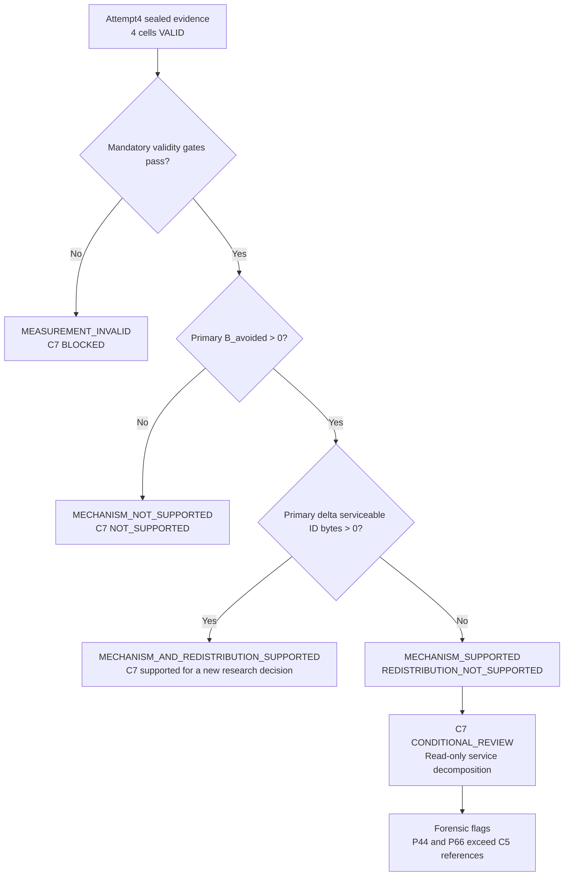

# C6 Formal Attempt4 Seven-Dimension Analysis

## Review boundary

This report reviews the sealed C6 Attempt4 communication/service evidence only. All four cells are mechanically `VALID`, the run ended `FORMAL_RUN_END / PASS`, and the Formal and baseline seals were independently reproduced. Tracking outcomes remain unopened.



Source diagram: `mermaid/exp_20260915_001/c6_formal_attempt4_decision_flow.mmd`.

## Dimension 1 — Hypothesis verdict and confidence

The preregistered primary cell, `pair_23__FIFO_strong`, has `B_avoided = 7,299,121`, so `H_M` is supported. Its serviceable ID-State delta is `0 - 3,221,174 = -3,221,174`, so `H_R` is not supported.

The exact frozen decision is therefore:

```text
C6_STATUS = MECHANISM_SUPPORTED_REDISTRIBUTION_NOT_SUPPORTED
C7_PROGRESS = CONDITIONAL_REVIEW
```

Confidence is high for the arithmetic and gate classification of this sealed deterministic run because all mandatory gates passed and the source quantities and seals were reproduced. Confidence does not extend to population-level or stochastic generalization because there is only one deterministic run per cell.

## Dimension 2 — Magnitude, direction, and ranking

| Cell | `B_avoided` | Treatment serviceable | Baseline serviceable | Delta | Delta direction |
| --- | ---: | ---: | ---: | ---: | --- |
| P23 strong | 7,299,121 | 0 | 3,221,174 | -3,221,174 | negative |
| P23 mild | 7,299,121 | 0 | 0 | 0 | null |
| P44 moderate | 5,619,894 | 0 | 5,533,432 | -5,533,432 | negative |
| P66 mild | 5,784,574 | 0 | 5,543,264 | -5,543,264 | negative |

P23 strong and mild tie for the largest avoided obligation. No cell shows positive redistribution. The strongest negative delta is P66, followed closely by P44, then P23 strong; P23 mild is zero because its frozen baseline also serviced zero serviceable ID-State bytes.

## Dimension 3 — Failure-mode localization

The failed component of the joint claim is redistribution, not mechanical validity and not the primary suppression measurement. Across the four treatment cells, the first-service decision counts are `2097`, `2097`, `1077`, and `897`, and every one is suppressed. Consequently, treatment serviceable ID-State serviced bytes equal zero in every cell.

The read-only decomposition also shows:

- P23: 7,299,121 suppressed-obligation bytes and 5,849,749 supplement-served bytes.
- P44: 5,619,894 suppressed-obligation bytes and 3,832,767 supplement-served bytes.
- P66: 5,784,574 suppressed-obligation bytes and 4,159,747 supplement-served bytes.
- All service-conservation checks pass and all remaining/pending bytes are zero.
- Suppressed decisions with empty `packet_reason_flags` number 1,021 for P23, 240 for P44, and 305 for P66.

These facts localize the observed boundary to the treatment decision/service trajectory. They do not by themselves identify a software defect or causal reason for the 100% suppression pattern.

## Dimension 4 — Ceiling and remaining headroom

Within the checked treatment trajectory, suppression is already at the observed first-service decision ceiling: 100% of checked ID-State decisions are suppressed. There is therefore no non-suppressed serviceable ID-State work in these cells onto which released capacity could be observed to redistribute.

This is a measured trajectory ceiling, not a universal scientific ceiling. It does not show that redistribution is impossible under other workloads, nor does it imply tracking benefit or harm. The unopened tracking outcomes cannot be used to reinterpret this boundary.

## Dimension 5 — Robustness and generalization

The qualitative pattern is consistent across all four frozen cells: positive `B_avoided`, zero treatment serviceable ID-State bytes, and no positive redistribution delta. Mechanical integrity is likewise consistent across cells.

Generalization remains limited for three reasons: one deterministic run per cell provides no stochastic variability estimate; only three pair identities are represented; and the P44/P66 treatment trajectories trigger a preregistered anomaly flag relative to their C5 descriptive opportunity references. The result is therefore definitive for the frozen decision gate, not a claim about broader workloads or network regimes.

## Dimension 6 — Relation to prior evidence

| Cell | Frozen C5 opportunity reference | C6 `B_avoided` | Difference | Ratio |
| --- | ---: | ---: | ---: | ---: |
| P23 strong | 2,968,912 | 7,299,121 | +4,330,209 | 2.4585× |
| P23 mild | 7,099,295 | 7,299,121 | +199,826 | 1.0281× |
| P44 moderate | 55,990 | 5,619,894 | +5,563,904 | 100.3732× |
| P66 mild | 156,485 | 5,784,574 | +5,628,089 | 36.9657× |

The P44 and P66 differences trigger the preregistered forensic-only flag. The C5 figures are descriptive references from a different trajectory, not upper bounds on C6 treatment bytes. Accordingly, the discrepancy requires trajectory/instrumentation reconciliation and cannot be interpreted as efficacy amplification.

## Dimension 7 — Priority-ranked next actions

1. **P0 — Read-only anomaly forensics.** Using only existing preregistered diagnostics, reconcile why P44/P66 treatment `B_avoided` is far above the C5 descriptive references and document the treatment-trajectory difference. Do not rerun or modify the runtime.
2. **P1 — Read-only predicate/schema evidence audit.** Account for the 100% suppression pattern and the suppressed decisions with empty `packet_reason_flags`, distinguishing recorded predicate evidence from missing explanatory labels without asserting a root cause prematurely.
3. **P2 — Preserve governance boundaries.** Freeze Attempt4 and its evidence package. Any new tracing, rerun, suppression-predicate change, scientific intervention, or C7 execution requires a new research decision and separate authorization.

There is no automatic C7 authorization from this review.

## Final conclusion

Attempt4 is a valid negative redistribution result with a positive suppression-mechanism measurement. C6 closes as `MECHANISM_SUPPORTED_REDISTRIBUTION_NOT_SUPPORTED`; C7 remains in `CONDITIONAL_REVIEW`. No tracking-result claim has been made.
