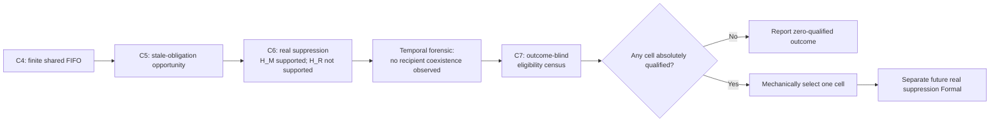

# C7 EXPERIMENT CONTRACT

## Outcome-Blind Frozen-Cell Eligibility Census for an H_R Formal Test

```text
DOCUMENT_ROLE = C7_EXPERIMENT_CONTRACT
EXPERIMENT_ID = exp_20260920_001_mdmt_mia_c7_outcome_blind_eligibility_census
CONTRACT_STATUS = APPROVED_AND_FROZEN
SCIENTIFIC_STAGE = SCIENTIFIC_CONTRACT_CLOSURE
EXECUTION_AUTHORIZATION_STATE = NOT_AUTHORIZED
```

This document translates the reviewed C7 Research Decisions into one scientific
contract. It does not define the lower-layer Pre-Census Specification and does
not authorize implementation, qualification, census execution, a real
suppression experiment, Formal execution, or tracking-outcome access.

---

## 1. Document identity and authority

| Field | Contract value |
| --- | --- |
| Document | C7 Outcome-Blind Frozen-Cell Eligibility Census Experiment Contract |
| Status | `DRAFT_FOR_TEAM_B_REVIEW` |
| Scientific authority | Reviewed C7 Research Decisions `RD-C7-01` through `RD-C7-27`, with `RD-C7-25` superseded and `RD-C7-26` replaced by `RD-C7-26R` |
| Upstream scientific lineage | C4 finite shared FIFO service; C5 read-only Shadow/Oracle Opportunity Census; C6 TRUE-first-service semantic suppression; C6 post-Formal temporal forensic analysis; C7 runtime and repeatability audits |
| Upstream frozen C6 verdict | `MECHANISM_SUPPORTED_REDISTRIBUTION_NOT_SUPPORTED` |
| Depends on | Frozen runtime semantics and hidden-state boundary recorded below |
| Next governance stage after approval | C7 Pre-Census Specification |
| Execution authorization | None |

Contract path:

```text
summary_md/experiments/2026-9-20/
  exp_20260920_001_mdmt_mia_c7_outcome_blind_eligibility_census/
  EXPERIMENT_CONTRACT.md
```

The earlier repository document named `C6_C7_DECISION_INPUTS.md` is upstream
decision-discussion evidence. It is not the authority for the completed C7
Research Decisions encoded here. This draft does not amend C4, C5, or C6.

---

## 2. Scientific motivation and lineage

C4 established that ID-State and Supplement share finite FIFO logical service
capacity, while Local Track and Homography are outside that bottleneck in the
C4 scope. Finite capacity can create queue pressure, completion delay, pending
work, and capacity dependence. C4 did not establish that stale ID-State service
causes tracking degradation.

C5 observed, without intervention, whether an ID-State packet could already be
semantically non-applicable at its TRUE first-service event. It established
potential stale service obligation, not causal harm or actual redistribution.

C6 suppressed a whole ID-State packet at its own TRUE first-service event when
all of its semantic effects were non-applicable. The packet then consumed zero
logical service bytes. C6 preserved FIFO, work conservation, packet atomicity,
ID-State-only suppression scope, and Supplement behavior. Its frozen verdict is:

```text
H_M = SUPPORTED
H_R = NOT_SUPPORTED
C6_VERDICT = MECHANISM_SUPPORTED_REDISTRIBUTION_NOT_SUPPORTED
```

Post-C6 temporal forensic analysis found:

```text
NO_RECIPIENT_COEXISTENCE_OBSERVED
```

The sealed C6 trajectory therefore lacked the structural recipient condition
needed to give redistribution a strong test. This does not change the C6 H_R
verdict. It motivates the narrower C7 prerequisite question: whether a finite,
pre-registered workload-by-capacity search space contains any cell that gives a
later real H_R suppression experiment a fair mechanistic opportunity.



---

## 3. Question, neutral census branches, and epistemic classification

### 3.1 Research question

> Does any pre-registered P23/P44/P66 by finite-capacity cell provide
> sufficient, non-trivial, outcome-blind within-frame redistribution
> opportunity to justify a later independent real H_R suppression Formal test?

### 3.2 Neutral pre-registered census branches

C7 has two valid, pre-registered census outcomes after every candidate cell is
evaluated against the same absolute, conjunctive qualification rule:

```text
BRANCH_A = QUALIFIED_CELLS >= 1
BRANCH_B = QUALIFIED_CELLS = 0
```

The rule retains eligible-opportunity count, overall opportunity frequency,
conditional opportunity frequency, and minimum event/denominator support. Its
exact outcome-blind threshold-generation procedure and numerical values are
deferred to, and must be frozen by, the Pre-Census Specification before any
census.

Neither branch is scientifically preferred, neither is a failure, and neither
may influence the capacity grid, denominator semantics, threshold-generation
procedure, or qualification logic. In particular, Branch B is a valid
scientific result and does not permit same-census search-space expansion.

### 3.3 Premise classification

#### FACT

- C4 finite service uses one shared FIFO logical byte budget for ID-State and
  Supplement.
- The effective service window is one frame; the budget resets at each
  `begin_frame()`.
- Unused capacity is reusable later in the same frame and cannot carry into the
  next frame.
- Partial packet service is possible, but partial bytes have no semantic effect;
  semantic commit occurs only at logical packet completion.
- Each packet's TRUE first-service predicate is evaluated individually after
  FIFO selection and before its first service byte.
- Normal completed ID-State service can change receiver-side state and therefore
  future applicability and serviceability.
- The current C4/C6 production path has no established scientific seed,
  communication stochastic realization, replicate runner, or independent
  stochastic repeat unit.
- C6 remains `MECHANISM_SUPPORTED_REDISTRIBUTION_NOT_SUPPORTED`.

#### INFERENCE

- A cell with repeated stale obligations, serviceable recipients, binding
  within-frame capacity loss, and conditional-accounting completion flips is a
  materially fairer candidate for a later H_R test than a cell lacking those
  structural conditions.
- Absolute count and both opportunity rates jointly distinguish non-trivial
  support from a single accident, a tiny denominator, or a negligible global
  frequency.

#### ASSUMPTION TO BE QUALIFIED LATER

- A future implementation can persist enough event-local evidence to verify
  each packet's own TRUE first-service stale classification without future
  information.
- A conditional capacity accounting shadow can preserve the observed baseline
  state, serviceability, FIFO, arrival, and frame-budget trajectory while
  changing only the permitted logical capacity accounting.
- The Pre-Census Specification can define a finite capacity grid and absolute
  thresholds solely from pre-C7 evidence and engineering facts.

These assumptions require later specification and mechanical qualification.
They are not implementation authorization.

#### UNKNOWN

- The exact capacity grid.
- The exact threshold-generation algorithm and numerical thresholds.
- Whether any candidate cell will qualify.
- Which cell, if any, will be selected for a later real suppression Formal.
- What actual suppression would causally do in a qualified cell.
- Whether a later real suppression run would support H_R or improve tracking.

---

## 4. Non-question and explicit exclusions

The C7 census does not answer or optimize:

- tracking improvement or degradation;
- H_R causal success;
- actual suppression-induced redistribution;
- scheduler optimality;
- AoI or predictive scheduling benefit;
- priority re-ranking or queue-time supersession;
- RL policy necessity;
- general cross-channel redistribution;
- Supplement as a primary recipient class;
- population-level stochastic generalization;
- CI-based stability across runs.

C7 is a deterministic census of registered frozen-cell trajectories. It is not
a treatment experiment and not a tracking evaluation.

---

## 5. Scientific objects

### 5.1 Pair

One frozen workload pair identity from the first-census set:

```text
P23 = Low historical workload member
P44 = Median historical workload member
P66 = High historical workload member
```

These labels describe the inherited workload family; they do not rank C7
eligibility in advance.

### 5.2 Cell

A registered `Pair x finite service-capacity` identity, together with its frozen
execution identity and trajectory. Eligibility is evaluated independently at
cell level.

### 5.3 Effective service window

Exactly one frame. Capacity released inside a frame can be reused later in that
frame but cannot be carried into another frame.

### 5.4 Suppressible stale obligation

The logical service obligation of an ID-State packet whose complete semantic
effect set is classified non-applicable at that packet's own TRUE first-service
event, before its first service byte and without future information.

The classification is made exactly once. Once a logical packet has been validly
classified `SUPPRESSIBLE_STALE`, that event-local classification remains
attached to that same packet for C7 conditional capacity accounting while its
baseline logical service obligation remains unfinished and present. This is
classification persistence, not current-frame reclassification: C7 does not
recompute receiver state, use a newer snapshot, change the historical decision,
or treat residual bytes as a new packet.

### 5.5 Serviceable ID-State recipient

An ID-State logical packet that is serviceable according to the observed
baseline receiver-state and eligibility trajectory at its relevant event in the
same effective service window. Supplement is not a primary C7 recipient.

### 5.6 Within-window completion loss

A serviceable ID-State recipient fails to complete its logical packet within
its intended one-frame service window because finite capacity is insufficient.
Partial service without completion counts as within-window loss. Later legal
completion does not erase the missed-window event. Extra waiting without a
missed within-window completion does not qualify.

### 5.7 Conditional capacity accounting shadow

An outcome-blind accounting construction that conditions on the observed
baseline:

- receiver-state trajectory;
- eligibility and serviceability trajectory;
- FIFO ordering;
- packet arrivals; and
- frame budget;

and changes only the logical capacity accounting for ID-State packets already
classified suppressible stale at their own TRUE first-service events.

For one current frame, its removable stale accounting set includes both:

- packets whose valid TRUE first-service stale classification occurs in that
  frame; and
- the remaining current-frame baseline logical service obligation of an
  unfinished packet validly classified suppressible stale at an earlier
  TRUE first-service event, if that residual obligation is actually present in
  the current baseline FIFO trajectory.

The latter uses the persisted earlier event-local classification only. It does
not carry released capacity across frames; each frame retains its own budget and
accounts only the obligation consuming capacity in that frame.

It is not a causal counterfactual simulation of actual suppression.

### 5.8 Eligible redistribution opportunity

A one-frame service window satisfying every eligibility invariant in Section 7.
If several recipients flip in one window, opportunity existence still uses the
window-level existence criterion; severity may be recorded separately.

### 5.9 Qualified cell

A cell that independently passes the absolute, pre-registered, conjunctive
qualification rule defined conceptually in Section 8 and mechanically frozen
before execution by the Pre-Census Specification.

---

## 6. Frozen runtime semantics

```text
EFFECTIVE_SERVICE_WINDOW = ONE_FRAME
BUDGET_SCOPE = FRAME_LEVEL_SHARED_FIFO_BUDGET
BUDGET_RESET = EVERY_BEGIN_FRAME
INTRA_FRAME_UNUSED_CAPACITY_REUSABLE = YES
INTER_FRAME_CAPACITY_CARRYOVER = NO
PARTIAL_PACKET_SERVICE = YES
PARTIAL_BYTES_HAVE_SEMANTIC_EFFECT = NO
SEMANTIC_COMMIT = LOGICAL_PACKET_COMPLETION
TRUE_FIRST_SERVICE_PREDICATE = PER_PACKET_AFTER_FIFO_SELECTION_BEFORE_FIRST_BYTE
```

Normal completed ID-State service can mutate the last accepted ID packet
version, applied ID mapping, row identities, matched IDs, confirmed IDs, and
future applicability/serviceability. Therefore, deleting stale work while
claiming that the fixed baseline state is the state actual suppression would
produce is scientifically invalid.

The only permitted shadow interpretation is conditional capacity accounting
under the observed baseline state and eligibility trajectory.

---

## 7. Eligible-window invariants

Define `WINDOW_ELIGIBLE` only when all of the following hold:

1. At least one suppressible stale ID-State obligation exists in the effective
   service window.
2. Each stale classification was made independently at that packet's own TRUE
   first-service event, after FIFO selection and before its first service byte.
3. No future state, later shared snapshot, tracking result, or post-outcome
   information participates in classification.
4. At least one serviceable ID-State recipient exists in the same one-frame
   window while any released capacity remains usable.
5. Under observed baseline service accounting, at least one such recipient
   misses logical packet completion inside that window because finite capacity
   is insufficient.
6. Recipient noncompletion alone is insufficient: the capacity relationship
   must be established by the conditional accounting construction.
7. The current-frame removable stale accounting set includes (a) packets
   classified suppressible stale at an event-local TRUE first-service event in
   the current frame and (b) any unfinished residual logical obligation actually
   consuming current-frame baseline capacity from a packet validly classified
   suppressible stale at an earlier TRUE first-service event.
8. A cross-frame residual uses only that persisted earlier classification. It
   is neither reclassified from current-frame receiver state nor treated as a
   new packet; future snapshots and historical-decision changes are forbidden.
9. Each frame remains an independent effective service window. Residual
   obligation may be removed from current-frame accounting, but released
   capacity may be reused only within that same frame and cannot carry over.
10. The accounting shadow preserves observed baseline receiver state,
   serviceability, FIFO order, arrivals, and frame budget.
11. It removes only the logical service obligation of the suppressible stale
   ID-State set; it introduces no scheduling, re-ranking, priority, prediction,
   AoI, supersession, or RL policy.
12. With only that accounting change, at least one baseline-incomplete,
    serviceable ID-State recipient becomes logically complete within the same
    frame.
13. A single recipient flip is sufficient for opportunity existence; not all
    recipients need to flip.
14. Supplement cannot satisfy the primary recipient condition.
15. No tracking outcome or treatment benefit is read or used.

Equivalent conceptual definition:

```text
WINDOW_ELIGIBLE =
  CURRENT_FRAME_REMOVABLE_STALE_ID_STATE_OBLIGATION_PRESENT
  AND EVENT_LOCAL_PER_PACKET_CLASSIFICATION_VALID
  AND SAME_FRAME_SERVICEABLE_ID_STATE_RECIPIENT_PRESENT
  AND BASELINE_WITHIN_WINDOW_COMPLETION_LOSS_EXISTS
  AND CONDITIONAL_ACCOUNTING_RELATIONSHIP_ESTABLISHED
  AND AT_LEAST_ONE_SAME_FRAME_RECIPIENT_COMPLETION_FLIP
  AND OUTCOME_BLIND
```

This is scientific semantics, not executable pseudocode. Exact mechanical
predicates and persisted evidence belong to the Pre-Census Specification.

---

## 8. Cell-level qualification invariants

For each cell, define conceptually:

```text
eligible_opportunity_count = count of WINDOW_ELIGIBLE service windows

overall_opportunity_frequency =
  eligible service windows / all service windows

conditional_opportunity_frequency =
  eligible service windows / stale-present candidate windows
```

The two rates are distinct and must both be retained. Overall frequency
describes how often the full cell trajectory offers a testable opportunity.
Conditional frequency describes how often stale-present candidate windows
become genuine redistribution opportunities.

For this scientific denominator, a stale-present candidate window includes a
window containing either a current-frame valid TRUE first-service stale
classification or an actually present residual logical obligation from a packet
with a previously persisted valid TRUE first-service stale classification. A
window containing only that residual must not be called stale-absent merely
because its original classification event occurred earlier. This defines
numerator/denominator semantic consistency only; the executable denominator
algorithm remains deferred to the Pre-Census Specification.

`CELL_QUALIFIED` requires a pre-registered conjunction over:

- a minimum eligible-opportunity count;
- minimum stale-present denominator support;
- an overall opportunity-frequency condition; and
- a conditional opportunity-frequency condition.

The conjunction is absolute: relative ranking cannot create qualification.
One isolated opportunity is insufficient. A tiny count with a high rate is
insufficient, and a large count with negligible trajectory-level frequency can
also be insufficient.

```text
CONCRETE_QUALIFICATION_RULE = DEFERRED_TO_PRE_CENSUS_SPECIFICATION
RUN_LEVEL_CI = NOT_USED
CI_LOWER_BOUND_QUALIFICATION = NOT_USED
QUALIFIED_CELLS_ZERO_ALLOWED = YES
```

Thresholds and the threshold-generation procedure must be frozen before the
census and must not use preliminary C7 eligibility, suppression-treatment, H_R,
or tracking outcomes.

---

## 9. Candidate search space

```text
PAIR_SET = P23, P44, P66
CAPACITY_GRID = TO_BE_FROZEN_IN_PRE_CENSUS_SPECIFICATION
CENSUS_MODEL = DETERMINISTIC_FROZEN_CELL_CENSUS
```

The capacity grid must be:

- finite;
- scientifically justified from pre-C7 evidence, existing engineering
  constraints, and existing C4/C5/C6 facts only;
- fully registered before census execution; and
- non-adaptive to C7 observations.

No new pair may enter the first census. The search cannot continue until a cell
qualifies. Each registered cell trajectory is exhaustively censused once under
its exact registered execution identity. Current C7 introduces no scientific
seed protocol, repeated stochastic realization, replicate runner, run-level CI,
or population-level stochastic inference.

`DETERMINISTIC_FROZEN_CELL_CENSUS` names this epistemic and statistical
interpretation: the census exhaustively analyzes each registered realized
trajectory once, and its statistics describe that frozen trajectory only. The
term does not assert bitwise or trajectory-identical end-to-end replay of the
external CUDA author workload under repeated launches. The absence of a
run-level CI, stochastic replicate protocol, or population-level inference is
unchanged.

### 9.1 Primary variable and controlled variables

The sole cell-level research variable is the pre-registered finite service
capacity within the frozen P23/P44/P66 workload family. Pair identity is a
frozen search-space axis, not an adaptively selected treatment. C7 introduces
no suppression treatment arm.

For every registered cell, the Pre-Census Specification must bind and hold
fixed the exact dataset/split and observation horizon, author/runtime identity,
model and checkpoint identity, tracker and association settings, packet schema
and byte-accounting convention, packet-generation and arrival semantics,
shared FIFO rules, receiver-state and serviceability observation semantics,
TRUE first-service predicate, recipient scope, and census measurement rules.
Only the registered pair and finite-capacity cell identity may differ.

The exact hashes and manifest fields used for those bindings are lower-layer
specification items. Failure to bind a controlled variable blocks that cell; it
does not authorize silently substituting another value.

### 9.2 Safety baseline, accounting comparison, and measurement gates

The safety baseline for each cell is its observed finite-FIFO service
accounting with no C7 accounting removal. The paired diagnostic comparison is
the conditional capacity accounting shadow defined in Section 5.7. It is not a
runnable treatment arm or a diagnostic oracle for tracking performance.

The minimum measurement gates are:

- exact registered cell and controlled-variable identity;
- complete service-window coverage over the frozen trajectory;
- event-local evidence for each suppressible-stale classification;
- FIFO and frame-budget accounting conservation;
- logical-packet completion accounting rather than partial-byte substitution;
- independently verifiable numerator and both denominators;
- explicit handling of missing or invalid denominator evidence; and
- proof that no forbidden tracking or treatment outcome entered the census.

Exact validator rules, evidence schemas, output roots, and required tables are
deferred to the Pre-Census Specification. This Contract defines no numerical
diagnostic upper bound beyond the accounting conservation constraints already
frozen above.

---

## 10. Selection after absolute qualification

Selection occurs only among cells that independently satisfy `CELL_QUALIFIED`.

1. Select the qualified cell with the largest absolute
   `eligible_opportunity_count`.
2. If absolute counts tie, compare overall and conditional opportunity
   frequencies. If one tied cell is at least as high on both and strictly higher
   on at least one, select that Pareto-dominant cell.
3. If the rates trade off or remain tied, use the frozen canonical stable order:

   ```text
   pair ID -> capacity ID -> cell ID
   ```

   This final tie-break has no scientific interpretation. No weights may be
   invented and neither rate may be declared intrinsically more important.

Exactly one qualified cell is selected for the first minimal later H_R Formal.
Other passing cells are labeled:

```text
QUALIFIED_BUT_DEFERRED
```

They are not rejected.

---

## 11. Outcome-blindness boundary

Eligibility, census, qualification, and cell selection must not read, derive,
join, rank by, or otherwise use:

```text
IDF1
ID switches / IDSW
tracking accuracy
MOTA
HOTA
association performance
suppression treatment benefit
downstream tracking outcome
```

The census asks only whether the service/capacity structure can give H_R a fair
mechanistic test. It does not ask whether tracking improved.

Tracking outcomes remain embargoed until a separately governed later Formal
stage explicitly authorizes them.

---

## 12. Evidence and claim boundary

```text
CONDITIONAL_CAPACITY_ACCOUNTING != CAUSAL_COUNTERFACTUAL_REPLAY
SHADOW_COMPLETION_FLIP != ACTUAL_SUPPRESSION_EFFECT
ELIGIBILITY_EVIDENCE != H_R_CAUSAL_EVIDENCE
C7_CELL_QUALIFIED != H_R_SUPPORTED
```

The conditional shadow deliberately holds descendants of baseline service
fixed. That makes it suitable for a conditional accounting question and
unsuitable for claiming what would happen under actual suppression.

Only a later independent real suppression execution in the selected qualified
cell can observe actual service redistribution and evaluate H_R. Even that
future stage must retain its own authorization and outcome-reading boundary.

---

## 13. Zero-qualification outcome

```text
QUALIFIED_CELLS = 0
```

is valid and reportable. Its required interpretation is:

```text
CURRENT_FROZEN_WORKLOAD_FAMILY
PROVIDES_NO_QUALIFIED_H_R_TEST_REGIME
```

It does not prove that redistribution is impossible outside the registered
space. It does prohibit adding pairs, adding capacity cells, lowering
thresholds, or altering denominators during the same C7 census.

Any future workload-family expansion requires a separate research stage and
new authorization.

This is Branch B of the neutral pre-registered census branches in Section 3.2.
It is neither a failure nor evidence that Branch A was scientifically preferred.

---

## 14. Items deferred to the Pre-Census Specification

The following are intentionally open lower-layer specification items, not
missing scientific decisions:

- exact finite capacity grid;
- number and identifiers of capacity points;
- exact outcome-blind threshold-generation algorithm;
- exact numerical qualification thresholds;
- minimum eligible-opportunity count;
- minimum stale-present denominator support;
- exact overall opportunity-frequency threshold;
- exact conditional opportunity-frequency threshold;
- exact predicate-evidence persistence schema;
- packet stale-classification persistence schema implementation;
- cell manifest and execution-identity schema;
- census report schema;
- validator and fail-closed rules;
- machine-readable eligibility and qualification algorithm;
- exact evidence provenance and sealing rules;
- exact mechanical handling of invalid or missing denominators;
- qualification-only fixtures and test architecture;
- runner and storage architecture.

The Pre-Census Specification may operationalize the frozen semantics. It may
not modify them or add a new scientific decision merely for implementation
convenience.

---

## 15. Forbidden adaptation

After the Pre-Census Specification is frozen, the same census may not:

- add capacity cells after inspecting results;
- add pairs beyond P23/P44/P66;
- search until a cell qualifies;
- lower thresholds or minimum support;
- change denominators or opportunity-rate definitions;
- change the eligible-window semantics;
- change the ID-State recipient scope;
- use tracking or treatment outcomes;
- convert conditional-accounting evidence into causal H_R evidence;
- introduce seeds, repeats, CI, or stochastic generalization post hoc; or
- rank unqualified cells into qualification.

Any need for such a change is a new research decision, not an engineering fix.

---

## 16. Authorization boundary and staged execution

Approval of this Contract authorizes none of the following:

```text
IMPLEMENTATION = NOT_AUTHORIZED
QUALIFICATION = NOT_AUTHORIZED
SCIENTIFIC_CENSUS_EXECUTION = NOT_AUTHORIZED
FORMAL_H_R_EXECUTION = NOT_AUTHORIZED
TRACKING_OUTCOME_READ = NOT_AUTHORIZED
```

The required governance sequence remains:

```text
Research Decisions
  -> approved C7 Experiment Contract
  -> C7 Pre-Census Specification
  -> Implementation Plan
  -> Implementation
  -> Qualification
  -> Census Execution Authorization
  -> outcome-blind deterministic census
  -> zero-qualified stop OR one mechanically selected qualified cell
  -> separate real suppression Formal authorization
  -> only then evaluate H_R
```

No minimum viable census, scientific census, or Formal command is specified by
this Contract. Compute budget, checkpoint/resume behavior, concrete condition
count, output paths, and stopping mechanics belong to later layers.

---

## 17. Decision history and superseded decisions

### RD-C7-12

The earlier proposal to remove stale service while holding the observed
receiver-state trajectory fixed is retained only as conditional capacity
accounting under RD-C7-21. It is not a full causal counterfactual.

### RD-C7-25

```text
EARLIER_RUN_LEVEL_CI_REQUIREMENT = SUPERSEDED_FOR_CURRENT_C7
RUN_LEVEL_CI = NOT_USED
CI_LOWER_BOUND_QUALIFICATION = NOT_USED
```

Minimum support now refers to sufficient events and denominators on a
deterministic frozen trajectory, not stochastic-population inference.

### RD-C7-26 and RD-C7-26R

```text
RD-C7-26_STOCHASTIC_REGIME_ASSUMPTION = REOPENED_BY_RUNTIME_EVIDENCE
RD-C7-26_STATUS = REPLACED
ACTIVE_REPLACEMENT = RD-C7-26R_DETERMINISTIC_FROZEN_CELL_CENSUS
```

No established scientific seed, communication realization, replicate runner,
or independent repeat unit exists in the current path. Current C7 therefore
makes trajectory-specific mechanistic eligibility claims only. The term
`DETERMINISTIC_FROZEN_CELL_CENSUS` does not claim that repeated complete CUDA
author launches have been proven replay-deterministic.

---

## 18. Research-Decision traceability

| Decision | Contract encoding | Status in this Contract |
| --- | --- | --- |
| RD-C7-01 | Binding capacity pressure is required | Active |
| RD-C7-02 | Overlap uses the one-frame effective window | Active |
| RD-C7-03 | Pressure is evaluated at window level | Active |
| RD-C7-04 | One accidental opportunity is insufficient | Active |
| RD-C7-05 | Absolute count and rate support are both required | Active |
| RD-C7-06 | Overall and conditional rates remain distinct | Active |
| RD-C7-07 | Binding pressure requires within-window completion loss | Active |
| RD-C7-08 | Completion unit is the logical packet | Active |
| RD-C7-09 | Later completion does not erase missed-window loss | Active |
| RD-C7-10 | At least one affected recipient is sufficient | Active |
| RD-C7-11 | Noncompletion alone cannot establish the capacity relationship | Active |
| RD-C7-12 | Historical fixed-state proposal | Corrected and governed by RD-C7-21 |
| RD-C7-13 | Preserve observed FIFO in accounting shadow | Active |
| RD-C7-14 | Remove full event-locally classified stale set within window, including present residual obligation under persisted packet classification | Active; CR1 clarification only |
| RD-C7-15 | One recipient completion flip establishes opportunity existence | Active; eligibility only |
| RD-C7-16 | Primary recipient scope is ID-State only | Active |
| RD-C7-17 | Threshold generation is frozen outcome-blind | Active |
| RD-C7-18 | Eligibility is independent per cell | Active |
| RD-C7-19 | Multiple-pass selection is pre-registered and mechanical | Active; resolved by RD-C7-22 |
| RD-C7-20 | Search space is finite and pre-registered | Active; pair boundary strengthened by RD-C7-27 |
| RD-C7-21 | Shadow is conditional accounting, not causal replay | Active corrective authority |
| RD-C7-22 | Count, Pareto-rate, stable-ID selection hierarchy | Active |
| RD-C7-23 | Absolute qualification precedes ranking | Active |
| RD-C7-24 | Minimum event and denominator support | Active deterministic interpretation |
| RD-C7-25 | Earlier CI requirement | Superseded for current C7 |
| RD-C7-26 | Earlier stochastic-regime assumption | Reopened and replaced |
| RD-C7-26R | Deterministic frozen-cell census | Active replacement |
| RD-C7-27 | First-census pair set is P23/P44/P66 only | Active |

---

## 19. Contract closure and open items

```text
SCIENTIFIC_DECISIONS_CLOSED =
  C7 question and claim boundary;
  one-frame opportunity semantics;
  cross-frame residual stale-obligation accounting under persisted event-local classification;
  binding-pressure and packet-completion semantics;
  conditional noncausal accounting shadow;
  ID-State-only recipient scope;
  absolute conjunctive qualification structure;
  two-rate retention;
  zero-qualified legality;
  post-qualification selection hierarchy;
  deterministic frozen-cell interpretation;
  P23/P44/P66 first-census pair boundary;
  outcome embargo and staged authorization.

PRE_CENSUS_SPECIFICATION_ITEMS_OPEN =
  finite capacity grid;
  outcome-blind threshold-generation mechanics;
  numerical support and rate thresholds;
  persisted evidence and manifest schemas;
  machine-readable predicates, validators, provenance, and runner mechanics.
```

If the Pre-Census Specification cannot operationalize this Contract without
changing the scientific question, metric definitions, recipient scope,
baseline conditioning, search boundary, or claim boundary, it must stop with:

```text
NEEDS_RESEARCH_DECISION
```

It must not repair the conflict by silently changing this Contract.

---

## 20. Contract-level decision gate

The census has two neutral, pre-registered contract-level branches. Neither is
scientifically preferred, neither is a failure, and neither may retroactively
affect the capacity grid, denominator definition, threshold procedure, or
qualification rule:

```text
IF QUALIFIED_CELLS = 0:
  DECISION = CURRENT_FROZEN_WORKLOAD_FAMILY_PROVIDES_NO_QUALIFIED_H_R_TEST_REGIME
  NEXT_ACTION = STOP; no same-census search-space expansion

IF QUALIFIED_CELLS >= 1:
  DECISION = AT_LEAST_ONE_MECHANISTIC_H_R_TEST_CANDIDATE_IDENTIFIED
  NEXT_ACTION = apply RD-C7-22; select exactly one cell; request separate real-suppression Formal governance
```

Neither branch evaluates H_R. A selected cell is a mechanistic Formal
candidate, not evidence that actual redistribution or tracking benefit exists.

---

## 21. Corrective revision #1

```text
CORRECTIVE_REVISION = #1
TRIGGER = TEAM_B_CONTRACT_REVIEW
P0_FIXED = 0
P1_FIXED = 1
P2_FIXED = 2
NEW_RESEARCH_DECISION = NO

CR1_P1 = CROSS_FRAME_RESIDUAL_SUPPRESSIBLE_STALE_OBLIGATION_SEMANTICS_CLARIFIED
CR1_P2A = QUALIFIED_AND_ZERO_QUALIFIED_BRANCHES_MADE_DIRECTIONALLY_NEUTRAL
CR1_P2B = DETERMINISTIC_CENSUS_DEFINED_AS_TRAJECTORY_SPECIFIC_EPISTEMIC_STATISTICAL_INTERPRETATION
```

This revision changes no active Research Decision. It clarifies only the
accounting scope of an already-valid packet-local classification and the
wording/auditability boundaries requested by Team B.

---

## 22. Document-only consistency seal

```text
CHECK_1_C6_H_R_PRESERVED = YES
CHECK_2_RD21_NONCAUSAL_SHADOW_PRESERVED = YES
CHECK_3_ID_STATE_RECIPIENT_SCOPE_PRESERVED = YES
CHECK_4_EFFECTIVE_WINDOW_ONE_FRAME = YES
CHECK_5_TRUE_FIRST_SERVICE_PER_PACKET = YES
CHECK_6_ZERO_QUALIFIED_ALLOWED = YES
CHECK_7_NO_SEARCH_UNTIL_QUALIFIED = YES
CHECK_8_P23_P44_P66_ONLY = YES
CHECK_9_DETERMINISTIC_CENSUS = YES
CHECK_10_CI_REMOVED_FROM_CURRENT_C7 = YES
CHECK_11_THRESHOLD_NUMBERS_NOT_INVENTED = YES
CHECK_12_CAPACITY_GRID_NOT_INVENTED = YES
CHECK_13_TRACKING_OUTCOME_EMBARGO_PRESERVED = YES
CHECK_14_CONTRACT_DOES_NOT_AUTHORIZE_EXECUTION = YES
```

```text
CHECK_CR1_01_CROSS_FRAME_RESIDUAL_STALE_CLASSIFICATION_PERSISTS = YES
CHECK_CR1_02_NO_FUTURE_RECLASSIFICATION = YES
CHECK_CR1_03_CURRENT_FRAME_RESIDUAL_OBLIGATION_ACCOUNTABLE = YES
CHECK_CR1_04_ONE_FRAME_CAPACITY_WINDOW_UNCHANGED = YES
CHECK_CR1_05_NO_CROSS_FRAME_CAPACITY_CARRYOVER = YES
CHECK_CR1_06_STALE_PRESENT_DENOMINATOR_SEMANTICS_CONSISTENT = YES
CHECK_CR1_07_ZERO_QUALIFIED_BRANCH_NEUTRAL = YES
CHECK_CR1_08_NO_PRIMARY_HYPOTHESIS_DIRECTIONAL_PRESSURE = YES
CHECK_CR1_09_DETERMINISTIC_CENSUS_TERM_CLARIFIED = YES
CHECK_CR1_10_NO_END_TO_END_REPLAY_DETERMINISM_CLAIM = YES
CHECK_CR1_11_CI_REMAINS_UNUSED = YES
CHECK_CR1_12_C6_H_R_VERDICT_UNCHANGED = YES
CHECK_CR1_13_RD21_NONCAUSAL_SHADOW_UNCHANGED = YES
CHECK_CR1_14_ID_STATE_RECIPIENT_SCOPE_UNCHANGED = YES
CHECK_CR1_15_P23_P44_P66_ONLY = YES
CHECK_CR1_16_NO_NEW_RD_INTRODUCED = YES
CHECK_CR1_17_NO_PRE_CENSUS_SPECIFICATION_STARTED = YES
CHECK_CR1_18_NO_EXECUTION_AUTHORIZED = YES
```

```text
CONTRACT_DRAFT_READINESS = READY_FOR_TEAM_B_REVIEW
```
